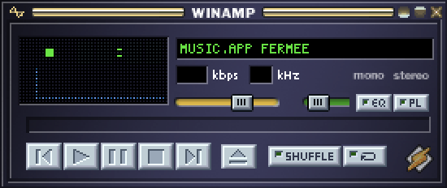
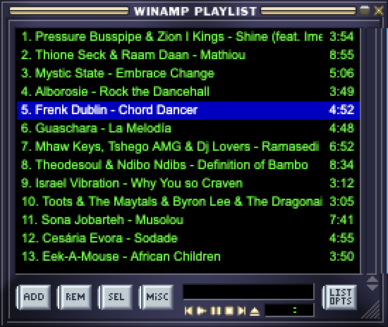
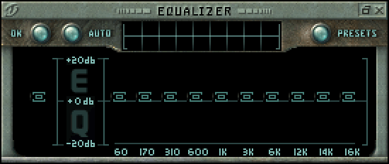

<div align="center">

# Llammp

**A Winamp 2 client for macOS that drives Apple Music.**

[](https://github.com/yoanbernabeu/Llammp/actions/workflows/ci.yml)
[](LICENSE)




</div>

Llammp is not a media player. Music.app decodes and plays; Llammp displays and commands.
All the value is in the fidelity to the Winamp of 1997 — a 275×116 window, original
`.wsz` skins, and a visualizer driven by the actual system audio.

```
┌────────────────────────┐        one JSON per line      ┌──────────────────────┐
│  Electron renderer     │◄──── stdout ── stdin ────────►│  Swift sidecar       │
│  skin, UI, visualizer  │       via the main process     │  NSAppleScript +     │
└────────────────────────┘                                │  DistributedNotif.   │
         │ loopback audio                                 └──────────┬───────────┘
         │ (getDisplayMedia)                                         │ Apple Events
         ▼                                                           ▼
   system audio                                                 Music.app
```

---

## Install

```bash
curl -fsSL https://raw.githubusercontent.com/yoanbernabeu/Llammp/main/install.sh | bash
```

The installer pulls the latest release, drops it into `/Applications` and **clears the
macOS quarantine flag**. Llammp is signed ad-hoc but **not notarized by Apple** — it is
only distributed here on GitHub — so without that step macOS refuses to open it and
claims the app is damaged.

Installing the archive by hand? Run this yourself:

```bash
xattr -dr com.apple.quarantine /Applications/Llammp.app
```

## Permissions

Llammp needs two, and neither can be worked around:

| Permission | Used for | How to grant |
|---|---|---|
| **Automation → Music** | driving playback (Apple Events) | dialog on first launch |
| **Screen & System Audio Recording** | the visualizer | System Settings › Privacy & Security, by hand |

The very first Apple Events call **blocks** until the dialog is answered. If Llammp shows
`MUSIC.APP CLOSED` while Music is playing, that dialog is waiting for you somewhere.

macOS does **not** show a prompt for the second one on an ad-hoc signed build: it has to
be enabled manually. Without it the audio track is delivered dead, silently, and the
visualizer stays flat.

## Skins

**Llammp ships with no skin.** Winamp skins are third-party artwork owned by their
authors, so none are redistributed here.

Get one from **[skins.webamp.org](https://skins.webamp.org)** (tens of thousands, one
click each), the [Internet Archive collection](https://archive.org/details/winampskins),
or [winamp.com](https://www.winamp.com/skins), then:

- **drag the `.wsz` onto the window** — installed and applied immediately, or
- **right-click → Add a skin…**, or
- **right-click → Open skins folder** and drop several at once.

Your skins live in `~/Library/Application Support/llammp/skins` and survive updates.
Classic Winamp 2 skins only; Winamp 3/5 `.wal` files are a different format.

## Using it

**Right-click anywhere** for the menu: skin selection, Playlist, Equalizer, always on top.

**Window docking**, like Winamp: the Playlist opens attached under the main window, and
moving the main window carries everything docked to it — transitively, so an Equalizer
stuck under the Playlist follows too. Drag a secondary window alone to detach it; it
snaps back within 12 px.

<div align="center">


</div>

## What works, and what cannot

The scope is not a matter of taste: it follows what Music.app actually exposes, measured
in `spikes/`.

| Feature | Status | |
|---|---|---|
| Transport, volume, seek, shuffle, repeat | ✅ | |
| Title, elapsed time, kbps / kHz | ✅ | kbps/kHz stay **empty** while streaming: reported as `missing value` |
| Playlist window | ✅ | 200-track window; enumerating a 6051-track playlist costs 10.6 s |
| Visualizer | ✅ | stereo, voice processing disabled |
| **Balance** | ❌ decorative | Music.app has no balance property at all |
| **Equalizer** | ❌ decorative | `EQ enabled` rejects writes (−10006), preset unreadable (−1728) |
| **Queue order with shuffle** | ⚠️ playlist order | playback order is exposed by no API — Winamp behaves the same |

## Development

```bash
./sidecar/build.sh          # Swift sidecar → app/bin/
cd app && npm install && npm start
```

> **The visualizer cannot work in development.** Launched from a terminal, the app
> inherits the terminal's TCC identity and the audio track arrives **dead, with no
> error**. That is documented macOS behaviour on 14.2+ with Electron 39+, not a Llammp
> bug. Package it to test audio: `npm run package && open dist/Llammp-darwin-arm64/Llammp.app`

Useful harnesses:

```bash
# Capture the windows to PNG — the UI is 275×116 px of sprites and cannot be reviewed
# by reading code
LLAMMP_SNAPSHOT=/tmp/main.png LLAMMP_SNAPSHOT_PLAYLIST=/tmp/pl.png npm start

# Exercise window docking without a mouse
LLAMMP_TEST_DOCK=1 npm start

# Drive the sidecar directly, no UI
echo '{"cmd":"refresh"}' | ./app/bin/llammp-sidecar
```

### Layout

```
app/
  main.js            windows, sidecar, loopback handler
  devtools.js        snapshot and docking harnesses (dev only)
  renderer/
    sprites.js       skin sprite atlas — coordinates frozen since 1997
    app.js           main window
    playlist.js      playlist window
    eq.js            equalizer window (decorative)
    vis.js           audio capture and analysis
  skin/loader.js     .wsz unpacking, VISCOLOR / PLEDIT / REGION
sidecar/             Swift bridge to Music.app
docs/                PRD, spec, gap analysis
spikes/              feasibility reports (M0, F4)
```

### Releasing

Tags drive versions. Push a SemVer tag and the workflow builds a universal binary,
packages the app, and publishes the release:

```bash
git tag v0.2.0 && git push origin v0.2.0
```

## Credits and legal

- Llammp is released under the [MIT license](LICENSE), © 2026 Yoan Bernabeu.
- The **Winamp source code** is not used here. Skin sprite coordinates come from the
  documented `.wsz` format and from inspecting bitmaps, never from Winamp's code.
- **Winamp skins** belong to their respective authors and are not redistributed. The
  screenshots above are illustrations of the software running.
- *Winamp* and *Apple Music* are trademarks of their respective owners. Llammp is not
  affiliated with, endorsed by, or connected to either.
